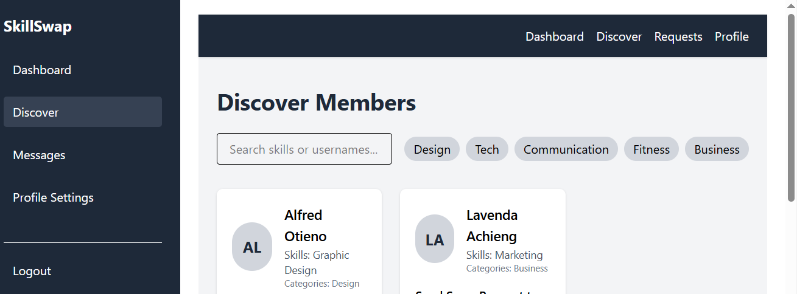
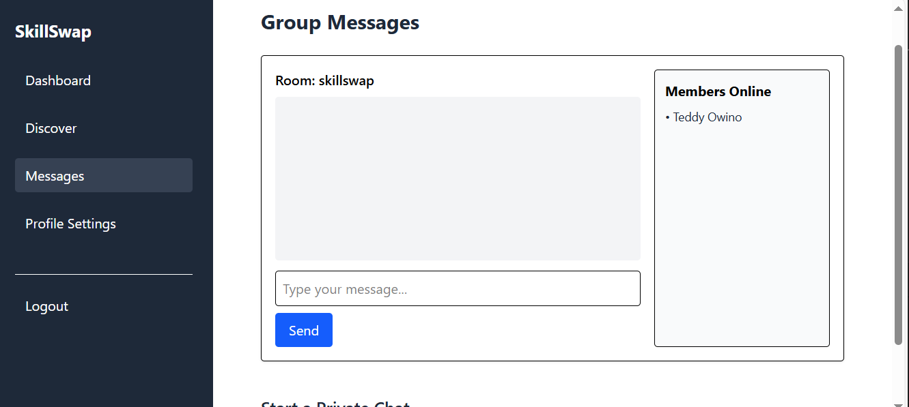
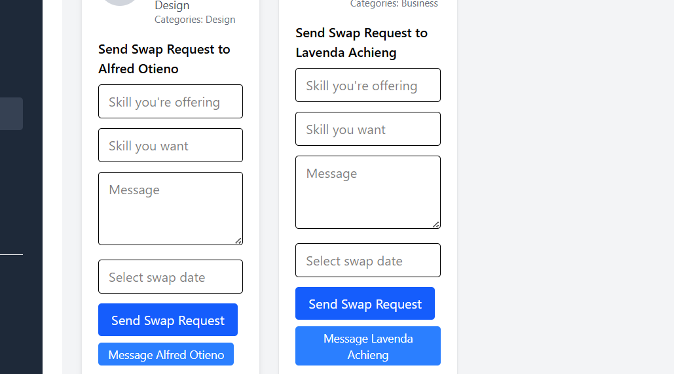

# SkillSwap

SkillSwap is a real-time web platform designed for creators, freelancers, and learners to exchange skills through structured conversations. Whether you're a developer looking for a designer, a marketer trading mentorship, or a hobbyist eager to teach and learn — SkillSwap enables skill discovery, messaging, and collaborative exchange.

---

##  Deployed Application

- Live App: https://skillswap-x5nj.onrender.com  
- Video Demo: https://your-demo-video-link.com

---

## Screenshots

| Discover Page | Direct Chat | Swap Request |
|---------------|-------------|--------------|
|  |  |  |


---

##  Tech Stack

**Frontend**
- React + Vite
- Tailwind CSS
- Zustand

**Backend**
- Node.js + Express
- MongoDB + Mongoose
- Socket.IO

**Deployment**
- Frontend: Vercel  
- Backend: Render

---

## 📦 Setup Instructions

### 1. Clone the repo

```bash
git clone https://github.com/Ted039/finalProject.git
```

### 2. Install & Start Frontend

```bash
cd client
npm install
npm run dev
```

### 3. Install & Start Backend

```bash
cd server
npm install
npm run start
```

### 4. Environment Variables

Create a `.env` file in the `server/` directory:

```
MONGO_URI=your_mongodb_connection_string
JWT_SECRET=your_jwt_secret
```

Update frontend API base URLs if necessary.

---

##  Features

- Skill-based user discovery
- Real-time group and direct messaging
- Structured swap request form
- Responsive UI across devices
- Live socket updates and typing indicators

---

##  Contact

**Developer:** Teddy  
**Email:** owinoteddy1997@gmail.com  
**GitHub:** https://github.com/Ted039  
**Location:** Nairobi, Kenya

---

Built with real-time collaboration in mind — SkillSwap connects people by what they teach and want to learn.
